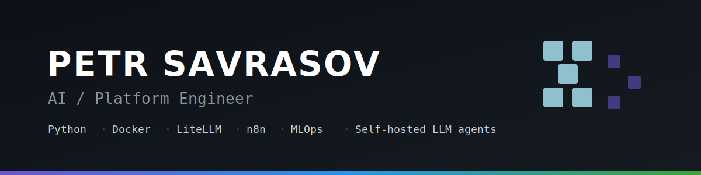
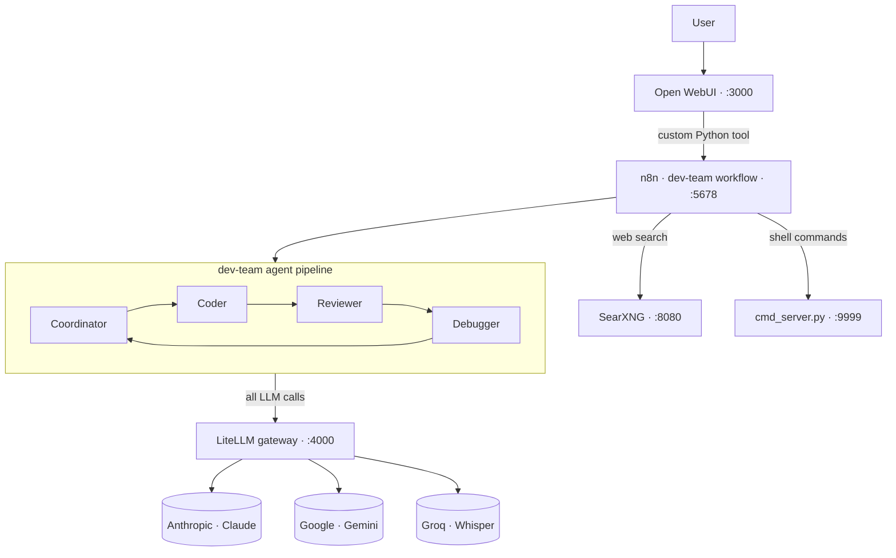
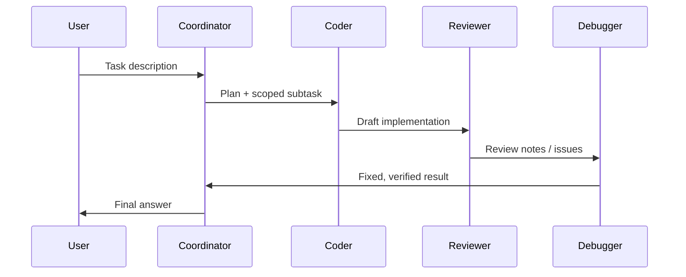

<!-- Rename this file to README.md in the root of your agent-system repo -->

<p align="center">
  
</p>

<h1 align="center">Self-Hosted AI Agent Platform</h1>

<p align="center">
  A fully self-hosted, multi-agent LLM platform that runs an automated
  <b>coordinator → coder → reviewer → debugger</b> pipeline on commodity, CPU-only hardware.
</p>

<p align="center">
  
  
  
  
  
  
</p>

---

## Overview

This project is a **production-style AI platform built from scratch and run entirely on-prem**.
It turns a single chat interface into a team of specialised LLM agents that plan, write,
review, and debug code, with built-in web search and controlled command execution.

The whole stack is orchestrated with **Docker Compose** and is designed to run on a
modest workstation (Intel i7-7700K, 16 GB RAM, **no GPU**) — model inference is offloaded
to multiple cloud LLM providers through a single gateway, so the local box only handles orchestration.

## Architecture



### Request lifecycle



## Components

| Service | Port | Role |
|---|---|---|
| **Open WebUI** | 3000 | Chat front-end; a custom Python tool forwards requests to the agent pipeline |
| **n8n** | 5678 | Orchestration engine; hosts the `dev-team` multi-agent workflow |
| **LiteLLM** | 4000 | OpenAI-compatible gateway; one place for model routing, keys and rate limits |
| **SearXNG** | 8080 | Self-hosted meta-search; gives agents web search without third-party search APIs |
| **cmd_server.py** | 9999 | Minimal HTTP server for controlled shell command execution on the host |

> **Why a gateway?** All model aliases are defined once in LiteLLM, so swapping the
> underlying provider/model is a config change — the n8n workflows never need to be touched.

### Model routing

Workflows reference task-based **aliases**, never concrete models — LiteLLM maps each alias
to the most suitable provider, so the whole stack is provider-agnostic by design.

| Alias | Provider · Model | Used for |
|---|---|---|
| `claude-coordinator` | Anthropic · Claude Sonnet 4.6 | planning & coordination |
| `qwen-coder` | Google · Gemini 2.5 Pro | code generation |
| `mistral-fast` | Google · Gemini 2.0 Flash-Lite | fast, cheap steps |
| `llama-quick` | Google · Gemini 2.0 Flash-Lite | quick utility calls |
| `whisper` | Groq · Whisper Large v3 | speech-to-text |

## Features

- 🤖 **Multi-agent pipeline** — coordinator, coder, reviewer and debugger collaborate on a single task
- 🧩 **Tool use** — agents can search the web (SearXNG) and run controlled shell commands (`cmd_server.py`)
- 🔌 **Provider-agnostic** — LiteLLM gateway routes task-based aliases across Anthropic, Google and Groq behind one OpenAI-compatible API
- 💬 **Single UI** — everything is driven from one Open WebUI chat
- 🏠 **Fully self-hosted** — no managed services; runs on a single CPU-only workstation
- 🔐 **Private remote access** — reachable from anywhere over a Tailscale tailnet (no exposed ports)

## Tech stack

`Python` · `Docker / Docker Compose` · `n8n` · `LiteLLM (Anthropic · Gemini · Groq)` · `Open WebUI` · `SearXNG` · `Tailscale` · `REST APIs`

## Getting started

### Prerequisites
- Docker Desktop (Compose v2)
- API keys for the providers you use (Anthropic / Google Gemini / Groq)
- *(optional)* Tailscale for remote access

### Run it
```bash
# 1. clone
git clone https://github.com/lastbrink-pixel/ai-agent-platform.git
cd ai-agent-platform

# 2. configure
cp .env.example .env
#    -> open .env and fill in your keys

# 3. start the stack
docker compose up -d

# 4. open the UI
#    http://localhost:3000
```

| Service | URL |
|---|---|
| Open WebUI | http://localhost:3000 |
| n8n | http://localhost:5678 |
| LiteLLM | http://localhost:4000 |
| SearXNG | http://localhost:8080 |

## Project structure

```
ai-agent-platform/
├─ docker-compose.yml
├─ cmd_server.py                    # controlled command execution (HTTP, :9999)
├─ .env.example
├─ litellm/
│  └─ config.example.yaml           # task-based model aliases & routing
├─ n8n/
│  └─ workflows/
│     ├─ dev-team-workflow.json      # coordinator → coder → reviewer → debugger
│     └─ agent-factory-workflow.json # generates / wires up new agents
├─ searxng/
│  └─ settings.yml
├─ banner.svg
└─ README.md
```
> The custom Open WebUI tool lives inside Open WebUI's own store; export it from
> Workspace → Tools if you want to version it here too.

## Roadmap

- [ ] Persistent task memory across agent runs
- [ ] Optional local inference via Ollama for offline/cheap tasks
- [ ] Per-agent metrics & token accounting
- [ ] Hardening of the command-execution surface

## License

Released under the MIT License — see [LICENSE](LICENSE).

---

<p align="center"><i>Built and operated end-to-end by Petr Savrasov.</i></p>
